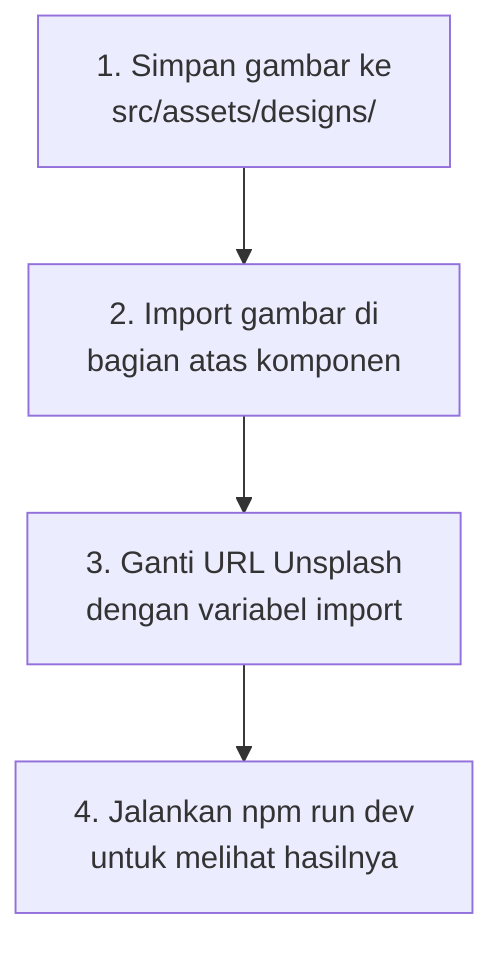

# 🎨 Tutorial Menambahkan Gambar Design ke Portfolio

## Struktur Folder Gambar

Website Anda memiliki **2 lokasi** untuk menyimpan gambar:

| Lokasi | Path | Kegunaan |
|--------|------|----------|
| **`src/assets/`** | `d:\PORTOFOLIO\Website porto promnt\portfolio-app\src\assets\` | ✅ **Direkomendasikan** — Gambar yang di-import langsung ke komponen React. Vite akan mengoptimasi dan memberikan hash unik. |
| **`public/`** | `d:\PORTOFOLIO\Website porto promnt\portfolio-app\public\` | Gambar yang diakses langsung via URL tanpa di-import. |

> [!TIP]
> Gunakan folder **`src/assets/`** untuk gambar design Anda. Ini yang paling umum dan optimal untuk proyek Vite + React.

---

## Langkah 1: Siapkan Folder & Simpan Gambar

Buat sub-folder di dalam `src/assets/` agar rapi:

```
src/
  assets/
    hero.png          ← sudah ada
    designs/           ← BUAT FOLDER BARU INI
      design-1.png
      design-2.jpg
      design-3.jpeg
      design-4.png
```

**Cara:**
1. Buka **File Explorer**
2. Navigasi ke `d:\PORTOFOLIO\Website porto promnt\portfolio-app\src\assets\`
3. Klik kanan → **New** → **Folder** → Beri nama `designs`
4. **Copy-paste** semua file gambar design Anda (PNG/JPG/JPEG) ke dalam folder `designs` tersebut

---

## Langkah 2: Pilih Komponen yang Ingin Ditambah Gambar

Website Anda memiliki beberapa bagian (section) yang bisa menampilkan gambar design:

### 🅰️ Portfolio (PALING COCOK untuk Design UI/UX)
- File: [Portfolio.jsx](file:///d:/PORTOFOLIO/Website%20porto%20promnt/portfolio-app/src/components/Portfolio.jsx)
- **Saat ini**: Menggunakan gambar dari URL Unsplash (link internet)
- **Yang perlu diubah**: Ganti URL Unsplash dengan gambar lokal Anda

### 🅱️ Projects (Untuk Proyek Coding/Web Dev)
- File: [Projects.jsx](file:///d:/PORTOFOLIO/Website%20porto%20promnt/portfolio-app/src/components/Projects.jsx)
- **Saat ini**: Tidak ada gambar sama sekali
- **Bisa ditambahkan** screenshot/preview proyek

### 🅲️ Hero (Halaman Utama)
- File: [Hero.jsx](file:///d:/PORTOFOLIO/Website%20porto%20promnt/portfolio-app/src/components/Hero.jsx)
- **Bisa ditambahkan** foto profil atau gambar hero banner

---

## Langkah 3: Cara Import & Gunakan Gambar

### Metode 1: Import di bagian atas file (✅ Direkomendasikan)

```jsx
// Tambahkan di baris paling atas file komponen
import design1 from '../assets/designs/design-1.png'
import design2 from '../assets/designs/design-2.jpg'
import design3 from '../assets/designs/design-3.jpeg'
import design4 from '../assets/designs/design-4.png'
```

Lalu gunakan variabelnya di `src`:
```jsx

```

### Metode 2: Simpan di folder `public/` (alternatif)

Jika gambar disimpan di `public/designs/`:
```jsx

```

> [!IMPORTANT]
> **Metode 1 lebih direkomendasikan** karena Vite akan mengoptimasi gambar secara otomatis dan memberikan cache-busting.

---

## Langkah 4: Contoh Lengkap — Ganti Gambar di Portfolio.jsx

Berikut contoh cara mengganti gambar Unsplash dengan gambar lokal Anda di [Portfolio.jsx](file:///d:/PORTOFOLIO/Website%20porto%20promnt/portfolio-app/src/components/Portfolio.jsx):

### 4a. Tambahkan Import Gambar (di baris paling atas)

```diff
  import { useState } from 'react'
  import { motion, AnimatePresence } from 'framer-motion'
  import { HiArrowNarrowRight, HiX, HiCheck } from 'react-icons/hi'
+ 
+ // Import gambar design Anda
+ import designFitness from '../assets/designs/fitness-app.png'
+ import designDashboard from '../assets/designs/dashboard-saas.jpg'
+ import designEcommerce from '../assets/designs/ecommerce-redesign.png'
+ import designLanding from '../assets/designs/landing-page.jpeg'
```

### 4b. Ganti URL `image` di Array Projects

```diff
  const projects = [
    {
      id: 1,
      title: 'Fitness Tracking Mobile App UI',
      category: 'mobile',
-     image: 'https://images.unsplash.com/photo-1561070791-2526d30994b5?w=800&h=600&fit=crop',
+     image: designFitness,
      // ... data lainnya tetap sama
    },
    {
      id: 2,
      title: 'SaaS Analytics Dashboard',
      category: 'dashboard',
-     image: 'https://images.unsplash.com/photo-1551288049-bebda4e38f71?w=800&h=600&fit=crop',
+     image: designDashboard,
      // ... data lainnya tetap sama
    },
    {
      id: 3,
      title: 'E-commerce Platform Redesign',
      category: 'web',
-     image: 'https://images.unsplash.com/photo-1460925895917-adf4e565db13?w=800&h=600&fit=crop',
+     image: designEcommerce,
      // ... data lainnya tetap sama
    },
    {
      id: 4,
      title: 'SaaS Product Landing Page',
      category: 'web',
-     image: 'https://images.unsplash.com/photo-1552664730-d307ca884978?w=800&h=600&fit=crop',
+     image: designLanding,
      // ... data lainnya tetap sama
    },
  ]
```

> [!NOTE]
> Anda tidak perlu mengubah tag `` di bawahnya. Komponen sudah menggunakan `project.image` sebagai `src`, jadi cukup ganti value `image` di array data saja.

---

## Langkah 5: Menambahkan Proyek Design Baru

Jika Anda ingin **menambah proyek baru** (bukan hanya mengganti yang ada), tambahkan object baru ke array `projects`:

```jsx
// Tambahkan import gambar baru
import designBaru from '../assets/designs/design-baru.png'

// Lalu tambahkan ke array projects (setelah object terakhir)
{
  id: 5,                          // id unik baru
  title: 'Nama Proyek Anda',
  category: 'mobile',             // pilih: 'mobile', 'web', atau 'dashboard'
  description: 'Deskripsi singkat proyek Anda.',
  longDescription: 'Deskripsi panjang tentang proses design Anda.',
  problem: 'Masalah yang ingin dipecahkan.',
  solution: 'Solusi design yang Anda buat.',
  outcome: 'Hasil yang dicapai.',
  image: designBaru,              // ← gambar design Anda
  tags: ['Mobile', 'UI Design', 'Figma'],
  tools: ['Figma', 'Adobe XD'],
},
```

---

## Tips Ukuran Gambar

| Komponen | Ukuran Rekomendasi | Rasio |
|----------|-------------------|-------|
| Portfolio Card | 800 x 600 px | 4:3 |
| Modal/Case Study | 1200 x 800 px | 3:2 |
| Hero Banner | 1920 x 1080 px | 16:9 |

> [!TIP]
> - Gunakan format **PNG** untuk screenshot design (kualitas lebih baik)
> - Gunakan format **JPG/JPEG** untuk foto (ukuran file lebih kecil)
> - Kompres gambar di [tinypng.com](https://tinypng.com) sebelum ditambahkan agar website tetap cepat

---

## Ringkasan Cepat



Apakah Anda ingin saya langsung **mengganti gambar** di komponen Portfolio.jsx dengan gambar Anda? Jika ya, **copy-paste dulu gambar design Anda ke folder `src/assets/designs/`** lalu beri tahu saya nama-nama filenya.
